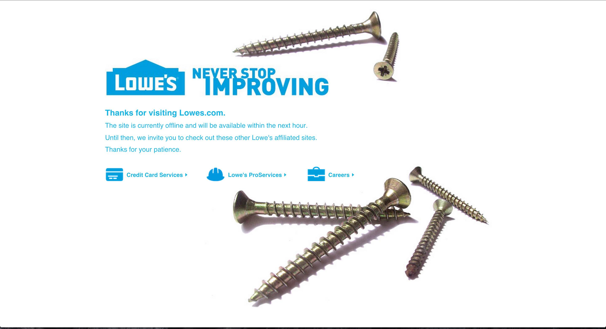

# Lowes Assessment

## Getting Started

* Pull down or unzip the repo titled `lowes`.
* Make sure you have node installed and run `npm install`.
* Next run the command `gulp production` to build our assets.
* Now everything should be ready to fire. Run `npm start`.
* Good luck!

## Author Summary
Well, here it is. I had fun building this assessment the last day or two. This assessment is the one I've built before about three years ago for my first opportunity at Lowes.

But my, how time changes. The visuals are the same but the dynamics are completely different.

Anyways, I interacted with Lowes API end point through the node server and then passed that data along to my template.

I then, stringified (not sure if that's a word) and parsed the data from my template to my react component(s).

This way of doing it feels a little dirty but I think it works well.

I did get a little concern when making my fetch to your API as data came back but all nested data was completely empty.

I thought my code was spotty, until I visited the URL provided directly and saw this...

Seeing that was somewhat of a relief.

Moving on...

React is extremely powerful and easy to work with. That's why I chose it to build out the remainder of the assessment.

I tried to roll some front-end unit testing but time is always pressing so I've decided to forgo the tests.

Just a personal note, pretty much all the software used in building this assessment was fun to work with. I still have a lot to learn but I'm confident I can contribute to whatever problems Lowes is trying to solve nowadays.

Also a side note, `mouseEnter` acts janky when you have your debug console opened in Chrome. Keep that in mind and don't be to severe when using the app with console opened if the hero doesn't fire properly.

Please, take your time looking around. And if you have any questions at all, don't hesitate to reach out to me with the contact details from below.

## Technology Used

* NodeJS -- <https://nodejs.org/>
* React -- <https://facebook.github.io/react/>
* Hapi -- <http://hapijs.com/>
* Babel -- <https://babeljs.io/>
* Gulp -- <http://gulpjs.com/>
* Webpack -- <http://webpack.github.io/>
* Jest -- <https://facebook.github.io/jest/>

## Assessment Directions

***Please code this assessment using Node.js

1.  Author all HTML5 and CSS to replicate the layout as prescribed in provided wireframe example (wireframe_example.jpg).

2.  Consume the following service and populate the page with the products and pricing returned. http://m.lowes.com/IntegrationServices/resources/productList/json/v3_0/4294857975?langId=-1&storeId=10702&catalogId=10051&nValue=4294857975&storeNumber=0595&pageSize=20&firstRecord=0&refinements=5003703

3. Consume the response on front end. (You may have to proxy this in your Node app)

4.  User Experience: Page should be responsive with at least one mobile and/or tablet experience.

5.  User Interactions:

	a.  When a user's mouse hovers over one of the products, the information for that product will appear in the larger "hero" area (to include switching the image asset from the smaller thumbnail to the medium image asset).

	b.  When a user clicks the "Add to Cart" element in the larger "hero" area, a JavaScript alert message will display the price of the item. The price displayed should be determined by the product shown in the masthead.

## Important Note
1. The node_modules does’t need to be included in the zip file. Just a package.json that would indicate which modules we need to install and their code.

2. Please change the file extension of your external JavaScript file(s) to .txt before resubmitting to prevent Lowe's email system from removing them.

## Contact

Email: [johnamiahford@gmail.com](mailto:johnamiahford@gmail.com)
Twitter: [@johnamiahford](http://www.twitter.com/johnamiahford)
